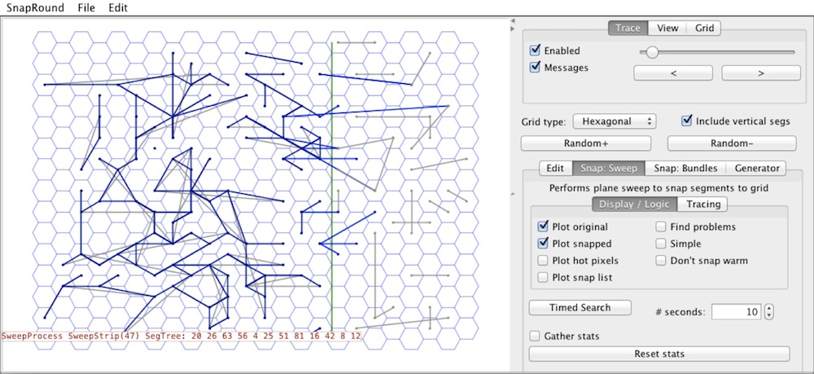

Snap Rounding in Tri And Hex Grids
===========

This Java program demonstrates some algorithms for performing
snap rounding in triangular and hexagonal (and square) grids.

The algorithm for square grids was presented at the 2007 Canadian Conference
on Computational Geometry; the paper and slides can be found [here](notes/cccg2007).
A discussion of snap rounding on triangular and hexagonal grids
can be found [here](notes/hsnap.pdf).
 
The program can be run as an application; its main class is snap.Main.class.
It can also be run as an applet, by loading the page "Applet.html" within a browser
(or from the command line: "appletviewer Applet.html"); it also can be found 
on [this page](http://www.cs.ubc.ca/~jpsember/sr.html).

